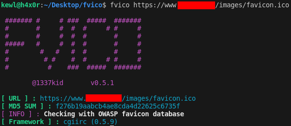

# FVICO
FVICO is a tool for identifying the web framework from stock favicon.<br>
FVICO looks for the MD5 sum of the favicon on [OWASP favicon database](https://wiki.owasp.org/index.php/OWASP_favicon_database)
 to identify the framework.



`This tool is helpful for CTF players`

## Installation
```bash
git clone https://github.com/1337kid/fvico.git
cd fvico
sudo make install
```
## Usage
```
# fvico url_to_favicon

fvico https://exampleweb.tld/favicon.ico
```
